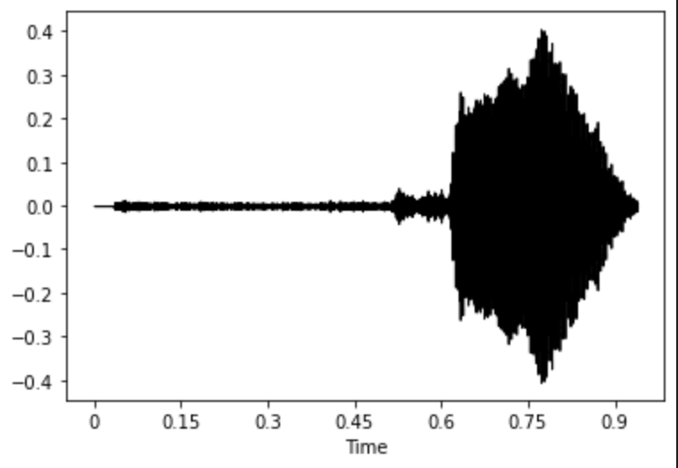
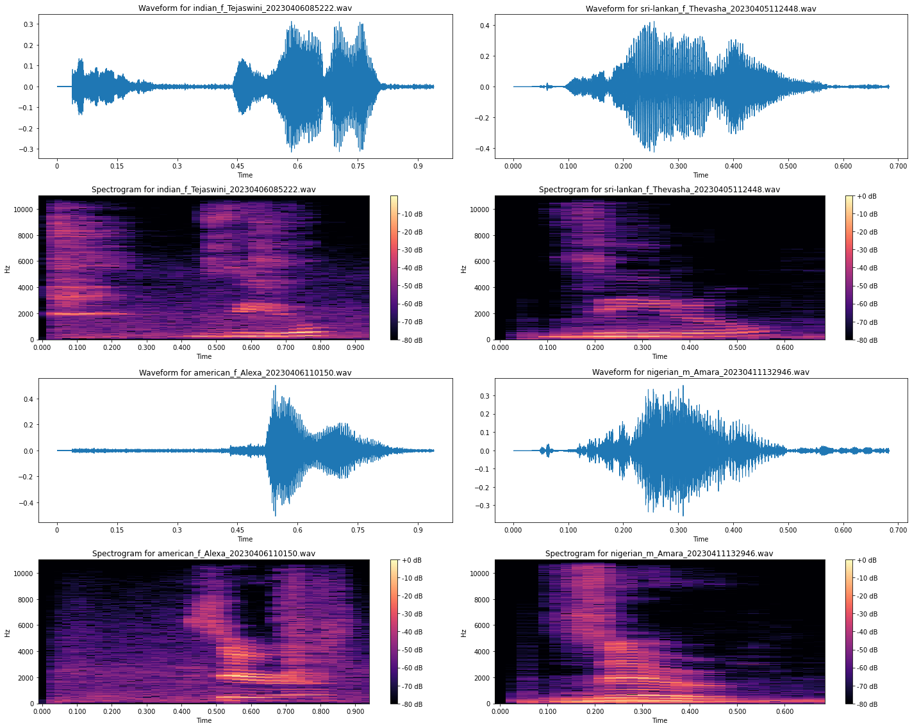
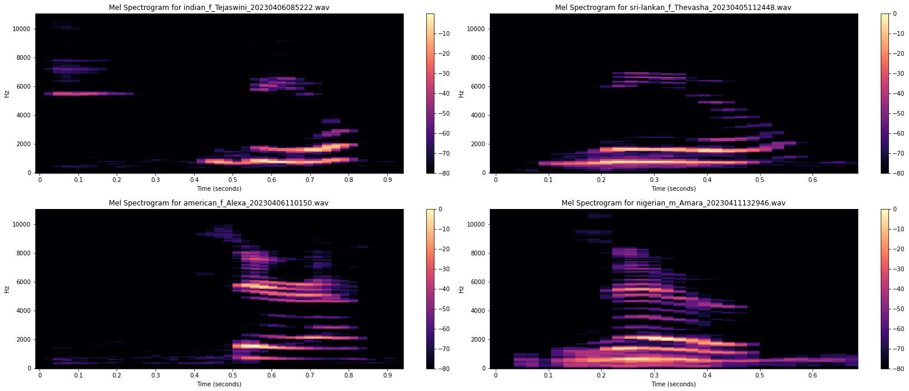
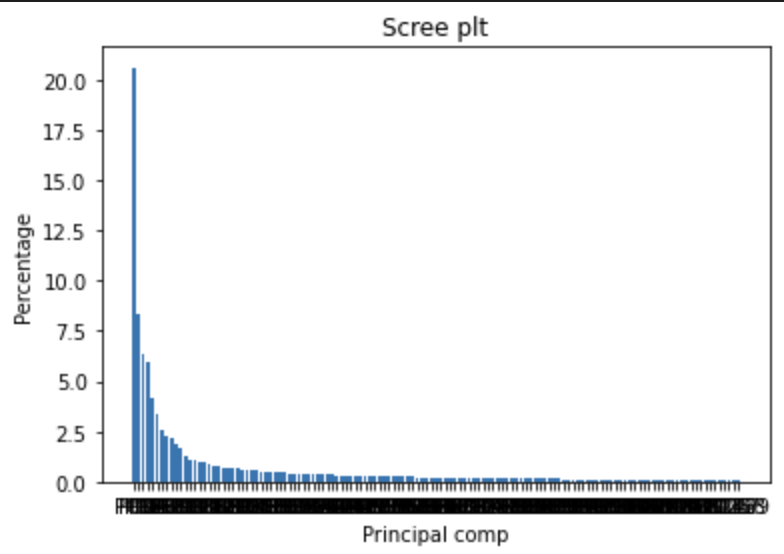
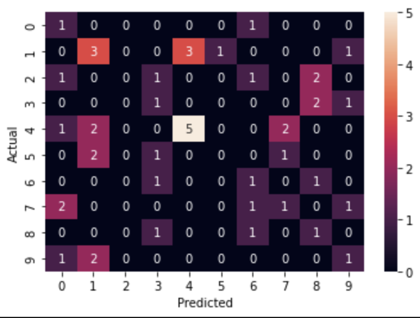
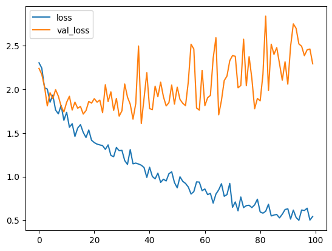

# Audio Classification.(Machine Learning and Deep Learning)


# Introduction

The goal of audio classification is to enable machines to automatically recognize and distinguish between different types of audio. In this project we have collected the audio's of different samples from different nationality. 
- Collection of audio through a web interface. 
- Exploratory Data Analysis of Audio data.
- Data Preprocessing.
- Audio Classification Model Creation.
- Testing Some Test Audio Sample.


## Authors
- [Siva Ram](https://github.com/KSiva199)
- [Nipuni Senani](https://github.com/NipuniSdSR)


## Technogies Used

**Programming Language:** Python, Flask, JavaScript and PHP

**Machine Learning Model:** PCA and Support Vector Machine

**Deep Learning:** Convolutional Neural Networks


## Installation
Clone or download repository to run.
- **Packages require:** Tensorflow, Scikit-Learn, Librosa, Pandas, Numpy, Glob, PIL, Matplotlib, Requests, BeautifulSoup, OS, Seaborn  
    
## Processing

```python
import librosa as librosa
import os
path = "/Users/ksr/Machine Learning/Final Project Audio/audio/4"
y,sr=librosa.load('audio/0/american_f_Alexa_20230406110149.wav',sr=32000)
librosa.display.waveshow(y,sr=sr,color='black')
```


```python
import librosa as librosa
import numpy as np
from matplotlib import pyplot as plt
import os
path = "/Users/ksr/Machine Learning/Final Project Audio/audio/0"
dir_list = os.listdir(path)
spectrograms = []
waveforms = []
for file in dir_list:
    actual='audio/0/'+file
    y, sr = librosa.load(actual)
    waveforms.append(y)
    spectrogram = librosa.stft(y)
    spectrograms.append(spectrogram)
for i, (waveform, spectrogram) in enumerate(zip(waveforms, spectrograms)):
    plt.figure(figsize=(10, 8))
    
    # plot waveform
    plt.subplot(211)
    librosa.display.waveshow(waveform, sr=sr)
    plt.title(f'Waveform for {dir_list[i]}')
    
    # plot spectrogram
    plt.subplot(212)
    librosa.display.specshow(librosa.amplitude_to_db(np.abs(spectrogram), ref=np.max),
                                y_axis='linear', x_axis='time') 
    plt.title(f'Spectrogram for {dir_list[i]}')
    plt.colorbar(format='%+2.0f dB')
    
    plt.tight_layout()
    plt.show()
```



``` python 
import librosa as librosa
import numpy as np
from matplotlib import pyplot as plt
import os
path = "/Users/ksr/Machine Learning/Final Project Audio/audio/0"
dir_list = os.listdir(path)
spectrograms = []
waveforms = []
mel_spectrogram=[]
for i,file in enumerate(dir_list):
    actual='audio/0/'+file
    y, sr = librosa.load(actual)
    waveforms.append(y)
    spectrogram = librosa.stft(y)
    spectrograms.append(spectrogram)
    S=librosa.feature.melspectrogram(y=y,sr=sr,n_mels=128,)
    s_db_mel=librosa.amplitude_to_db(S, ref=np.max)
    mel_spectrogram.append(s_db_mel)
    plt.figure(figsize=(14,5))
    img=librosa.display.specshow(s_db_mel,sr=sr,x_axis='s',y_axis='linear')
    plt.title(f'Mel Spectrogram for {dir_list[i]}')
    plt.colorbar()
    print(s_db_mel.shape)

```


```python
import pickle
import pandas as pd
import numpy as np 
from matplotlib import pyplot as plt
features=[]
target=[]
with open("data/mel_spectrograms.pickle", "rb") as f:
    data = pickle.load(f)
    for j in range(0,len(data)):
        for i in range(0,len(data[j])): 
            features.append(data[j][i].flatten())
            target.append(j)
features_df=pd.DataFrame(features)
features_df.fillna(0,inplace=True)
from sklearn.preprocessing import StandardScaler
scaler=StandardScaler()
scaled=scaler.fit_transform(features_df)
from sklearn.decomposition import PCA
pca = PCA(0.99)
pca.fit(scaled)
pca_data = pca.transform(scaled)
per_var = np.round(pca.explained_variance_ratio_* 100,decimals=1)
labels = ['PC' + str(x) for x in range(1, len(per_var) + 1)]

plt.bar(x = range(1,len(per_var)+1),height=per_var,tick_label = labels)
plt.ylabel('Percentage')
plt.xlabel('Principal comp')
plt.title('Scree plt')
plt.show()
pca.n_components_
```


```python
from sklearn.model_selection import train_test_split
from sklearn.metrics import confusion_matrix
import seaborn as sb
X_train,X_test,y_train,y_test=train_test_split(scaled,target,test_size=0.2)
from sklearn.svm import SVC 
model=SVC(C=500,kernel='rbf')
model.fit(X_train,y_train)
y_pred=model.predict(X_test)
model.score(X_test,y_test)
cm=confusion_matrix(y_test,y_pred)
sb.heatmap(cm,annot=True)
plt.show()
```



```python
#CNN

from tensorflow.keras.models import Sequential
from tensorflow.keras.layers import Conv2D, MaxPooling2D, Flatten, Dense, Dropout
from tensorflow import keras

model = Sequential()

model.add(Conv2D(32, (3, 3), activation='relu', input_shape=(img_width, img_height, 3)))
model.add(MaxPooepochs = 100
early_stopping_cb = keras.callbacks.EarlyStopping(patience=100,restore_best_weights=True)
history = model.fit(
    train_generator,
    steps_per_epoch=train_generator.n//train_generator.batch_size,
    epochs=epochs,
    validation_data=validation_generator,
    validation_steps=validation_generator.n//validation_generator.batch_size,
    callbacks=[early_stopping_cb])
ling2D((2, 2)))
model.add(Conv2D(64, (3, 3), activation='relu'))
model.add(MaxPooling2D((2, 2)))
model.add(Conv2D(128, (3, 3), activation='relu'))
model.add(MaxPooling2D((2, 2)))
model.add(Conv2D(128, (3, 3), activation='relu'))
model.add(MaxPooling2D((2, 2)))
model.add(Flatten())
model.add(Dropout(0.5))
model.add(Dense(512, activation='relu'))
model.add(Dense(10, activation='softmax'))

model.compile(loss='categorical_crossentropy', optimizer='adam', metrics=['accuracy'])
```



## Conlusion
This project was to test out audio data which was collected in our survey method. The model was performing better with CNN compared to SVM. However CNN was over fitting due o less data. 

## Support

For support, email  

korakus@clarkson.edu                                                                                    
desilvr@clarkson.edu


